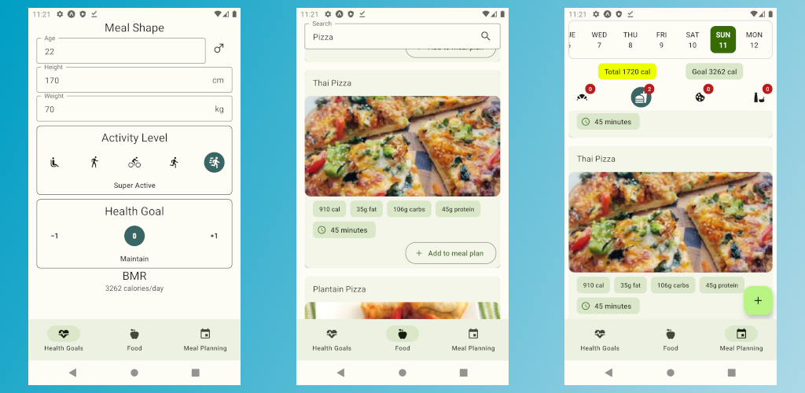
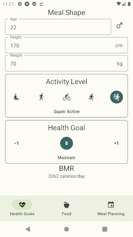
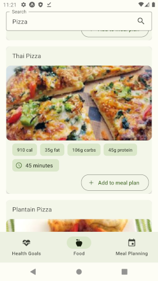
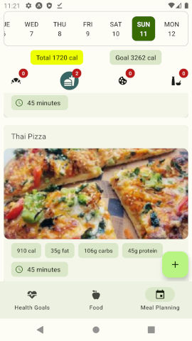
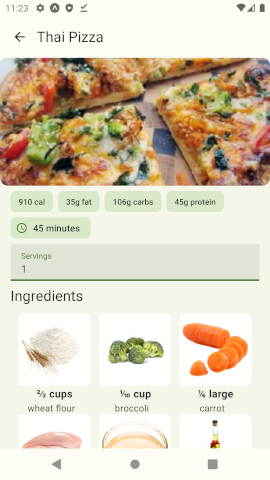
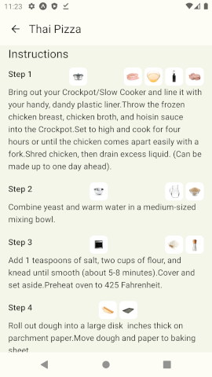

# Meal Shape



## Download on the Play Store

[](https://play.google.com/store/apps/details?id=com.mealshape)

## Team

- [@AntoninJuquel](https://github.com/AntoninJuquel)
- [@RajPorus19](https://github.com/RajPorus19)

## Description

Meal Shape is a mobile application that allows you to calculate your daily calorie needs and to have a personalized meal plan according to your goal (lose weight, gain weight, maintain your weight).

## Technologies

[](https://www.typescriptlang.org/)

[](https://expo.io/)

[](https://reactnative.dev/)

[](https://callstack.github.io/react-native-paper/)

[](https://reactnavigation.org/)

## Installation

### 1. Clone the project

```bash
git clone https://github.com/AntoninJuquel/meal-planner-esiee
```

### 2. Install dependencies

```bash
yarn install
```

### 2. b In case of error, remove yarn.lock and node_modules

```bash
rm yarn.lock
rm -rf node_modules
```

### 3. API key

- You need to register on [Spoonacular](https://spoonacular.com/food-api) and get an API key
- Then create a file named .env in the root of the project and add the following line

```bash
export API_KEY="YOUR_API_KEY"
```

### 4. Run the project

```bash
yarn start
```

## Usage

### 1. Get your daily calorie needs



### 2. Find your favorite recipes



### 3. Organize your meal plan



### 4. View the recipes of your meal plan




## License

[MIT](https://choosealicense.com/licenses/mit/)

## Acknowledgements

- [Spoonacular](https://spoonacular.com/food-api)
- [Expo](https://expo.io/)
- [React Native](https://reactnative.dev/)
- [React Native Paper](https://callstack.github.io/react-native-paper/)
- [React Navigation](https://reactnavigation.org/)

## Privacy Policy

https://antoninjuquel.github.io/meal-planner-esiee/privacy

## Terms and Conditions

https://antoninjuquel.github.io/meal-planner-esiee/terms
